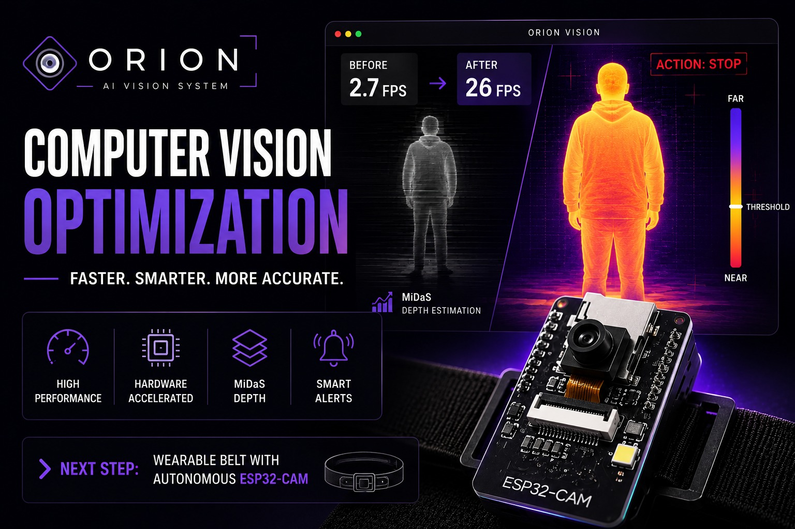

# 🌌 ORION | Optical Recognition & Intelligent Obstacle Navigation

**ORION** es un sistema de visión artificial y navegación asistida en tiempo real basado en estimación de profundidad monocular (**MiDaS**). Procesa flujos de video inalámbricos de alta velocidad (30 FPS) desde microcontroladores **Seeed Studio XIAO ESP32S3 Sense**, detecta obstáculos en el corredor de avance, calcula su proximidad relativa y emite alertas visuales y acústicas progresivas con tolerancia a fallos mediante conmutación en caliente (*Hot-Swap*).


<div align="center">
  
</div>

---

## 🎥 Demo

Demostración de **Projection Mapper** en funcionamiento:

[](https://youtu.be/UGBBGHXeREA)

---

## 🧭 Estructura del Repositorio

Para mantener un proyecto modular, limpio y escalable, el código ha sido organizado separando sus versiones de desarrollo y centralizando la documentación técnica:

```text
ORION/
├── main.py                       # 🚀 Lanzador principal multi-versión (v5 por defecto)
├── main_web_xiao.py              # 🔄 Wrapper de compatibilidad para scripts macOS (.sh)
├── versions/                     # 📦 Módulos organizados por versión
│   ├── v1_desktop_initial/       # Versión 1: Desktop OpenCV síncrono inicial
│   ├── v2_desktop_optimized/     # Versión 2: Desktop multihilo con HUD y telemetría
│   ├── v3_web_local/             # Versión 3: Servidor Web FastAPI con cámara local
│   ├── v4_web_esp32/             # Versión 4: Servidor Web con ESP32-CAM AI-Thinker
│   └── v5_web_xiao_esp32s3/      # Versión 5: Web XIAO ESP32S3 + Hot-Swap + Daemon [ACTUAL]
├── docs/                         # 📚 Centro de documentación oficial
│   ├── ARCHITECTURE.md           # Arquitectura profunda, IA, streaming y audio
│   ├── VERSIONS.md               # Comparativa y evolución detallada de v1 a v5
│   ├── HARDWARE_XIAO_ESP32S3.md  # Conexión, antena y flasheo de XIAO ESP32S3
│   ├── HARDWARE_ESP32_CAM.md     # Programación FTDI para ESP32-CAM AI-Thinker
│   ├── MACOS_SERVICE.md          # Configuración de arranque automático en macOS (.sh)
│   └── API_AND_TELEMETRY.md      # Especificación de endpoints REST y WebSockets
├── templates/
│   └── index.html                # Interfaz web reactiva compartida
├── utils/
│   └── xiao_discovery.py         # Motor de escaneo y descubrimiento dinámico de red
├── images/                       # Recursos gráficos y multimedia
└── tests/                        # Scripts de diagnóstico de red y cámara
```

---

## 🚀 Inicio Rápido (Quick Start)

### 1. Instalación de Dependencias

```bash
# En macOS (Apple Silicon M1/M2/M3)
pip install -r requirements-mac.txt

# En Windows / Linux
pip install -r requirements.txt
```

### 2. Iniciar el Sistema (Versión Insignia v5)

Simplemente ejecuta el lanzador universal en la raíz del proyecto:

```bash
# Iniciar con detección automática
python main.py

# En Mac (aceleración por Metal MPS y puerto específico)
python main.py --device mps --port 8000

# Con IP estática para la cámara XIAO
python main.py --xiao-ip 172.16.121.118
```

El servidor abrirá automáticamente el panel web interactivo en [http://localhost:8000](http://localhost:8000).

---

## 🗂️ Selección de Versiones

ORION permite ejecutar cualquier versión histórica o especializada mediante el argumento `--version` o `-V`:

```bash
# Listar todas las versiones disponibles y su descripción
python main.py --list

# Ejecutar una versión específica
python main.py --version 1      # v1: Desktop Inicial (OpenCV)
python main.py --version 2      # v2: Desktop Optimizado (HUD Telemetría)
python main.py --version 3      # v3: Web Dashboard (Cámara Local)
python main.py --version 4      # v4: Web ESP32-CAM (AI-Thinker)
python main.py --version 5      # v5: Web XIAO ESP32S3 Sense (Por defecto)
```

Para más detalles sobre los cambios y diferencias entre versiones, consulta **[docs/VERSIONS.md](docs/VERSIONS.md)**.

---

## 🌟 Características de la Versión Actual (v5)

1. **30 FPS MJPEG Inalámbrico Continuo:**
   - Firmware con reloj de sensor a 16 MHz y eliminación de timeouts TCP para eliminar congelamientos de fotograma.
2. **Conmutación en Caliente (Hot-Swap) y Rollback:**
   - Si la cámara XIAO se desconecta o se apaga, la cámara web integrada de la computadora toma el control en menos de 1 segundo sin reiniciar el servidor.
   - Cuando el XIAO se reconecta, el sistema regresa al stream inalámbrico de forma transparente.
3. **Arranque en Segundo Plano como Servicio en macOS:**
   - Generación del archivo `.orion_port` en la raíz para sincronización con scripts automáticos `.sh` de inicio de sesión.
4. **Telemetría WebSocket a 25 Hz:**
   - Manómetro de proximidad, zonas de advertencia (izquierda, centro, derecha) y gráficas en vivo en [HTML5](templates/index.html).

---

## 📚 Documentación Técnica Detallada

Para guías paso a paso de hardware y configuración del sistema operativo:

* 🏗️ **[Arquitectura y Funcionamiento Interno](docs/ARCHITECTURE.md)**
* 🛠️ **[Guía de Hardware: XIAO ESP32S3 Sense](docs/HARDWARE_XIAO_ESP32S3.md)**
* 🛠️ **[Guía de Hardware: ESP32-CAM](docs/HARDWARE_ESP32_CAM.md)**
* 🍎 **[Configuración de Servicio Automático en macOS](docs/MACOS_SERVICE.md)**
* 🌐 **[Especificación de API REST y WebSockets](docs/API_AND_TELEMETRY.md)**

---

## ⚙️ Parámetros CLI Principales

| Parámetro | Opciones / Tipo | Por Defecto | Descripción |
| :--- | :--- | :--- | :--- |
| `--version`, `-V` | `1`, `2`, `3`, `4`, `5` | `5` | Versión de ORION a ejecutar. |
| `--list`, `-l` | Flag | - | Muestra todas las versiones disponibles y sale. |
| `--xiao-ip` | IP (`str`) | Auto-discovery | IP del XIAO ESP32S3 Sense. |
| `--device` | `auto`, `cpu`, `cuda`, `mps` | `auto` | Dispositivo de cómputo para la red neuronal. |
| `--port` | Entero | `8000` | Puerto del servidor web HTTP/WebSocket. |
| `--near-threshold` | Float (`0.0` - `1.0`) | `0.60` | Umbral relativo para activar alerta de `STOP`. |
| `--no-local-sound` | Flag | Desactivado | Desactiva las alarmas sonoras locales. |

---

## 👥 Autores y Mantenimiento

* **Desarrollo y Arquitectura:** Equipo ORION
* **Licencia:** MIT
