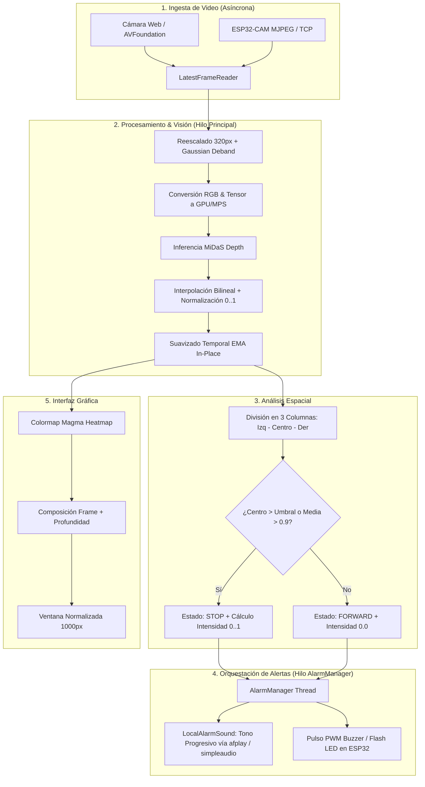

# 🌌 ORION | Sistema de Navegación y Detección de Obstáculos

> **ORION** es un sistema inteligente de visión artificial y navegación asistida en tiempo real basado en estimación de profundidad monocular (**MiDaS**). Procesa transmisiones de video (desde cámaras web locales o módulos inalámbricos **ESP32-CAM**) para detectar obstáculos en el entorno, calcular su nivel de cercanía y emitir alertas visuales y sonoras progresivas.

---

## 📋 Tabla de Contenidos

- [Visión General del Proyecto](#-visión-general-del-proyecto)
- [Evolución y Mejoras: `mainv2.py` vs `main.py`](#-evolución-y-mejoras-mainv2py-vs-mainpy)
  - [1. Aceleración en macOS / Apple Silicon (MPS)](#1-aceleración-en-macos--apple-silicon-mps)
  - [2. Optimización del Pipeline de Inferencia](#2-optimización-del-pipeline-de-inferencia)
  - [3. Sistema de Audio y Alertas Multinivel](#3-sistema-de-audio-y-alertas-multinivel)
  - [4. Captura Asíncrona y Latencia Cero](#4-captura-asíncrona-y-latencia-cero)
  - [5. Estabilidad y Escalado de la Interfaz Gráfica](#5-estabilidad-y-escalado-de-la-interfaz-gráfica)
  - [Tabla Comparativa Resumen](#tabla-comparativa-resumen)
- [Arquitectura y Flujo de Funcionamiento](#-arquitectura-y-flujo-de-funcionamiento)
- [Instalación y Requisitos](#-instalación-y-requisitos)
- [Guía de Inicio Rápido](#-guía-de-inicio-rápido)
  - [Modo 1: Cámara Web Local (Mac / PC)](#modo-1-cámara-web-local-mac--pc)
  - [Modo 2: ESP32-CAM con Búsqueda Automática](#modo-2-esp32-cam-con-búsqueda-automática)
  - [Modo 3: ESP32-CAM con IP Específica](#modo-3-esp32-cam-con-ip-específica)
- [Parámetros de Línea de Comandos (CLI)](#-parámetros-de-línea-de-comandos-cli)
- [Herramientas Auxiliares](#-herramientas-auxiliares)
- [Firmware ESP32-CAM](#-firmware-esp32-cam)

---

## 🔭 Visión General del Proyecto

ORION captura el flujo de video en vivo, preprocesa los fotogramas y ejecuta una red neuronal profunda (**MiDaS**) para estimar la profundidad relativa de cada píxel sin necesidad de sensores LiDAR o cámaras estéreo.

A partir del mapa de profundidad resultante:
1. **Analiza el tercio central** del campo visual (trayectoria de avance).
2. **Evalúa la proximidad y densidad** de los obstáculos frente al dispositivo.
3. **Toma decisiones de navegación**:
   - `FORWARD`: Camino despejado.
   - `STOP`: Obstáculo detectado en la zona crítica o proximidad general excesiva.
4. **Activa un sistema de alerta reactivo**:
   - **Visual**: Indicador en pantalla con mapa de calor (Colormap Magma) y delimitadores de carril.
   - **Sonoro local**: Tono acústico sintetizado en el ordenador (con volumen, tono y frecuencia progresivos).
   - **Hardware externo**: Activación por PWM del buzzer y flash LED en la placa ESP32-CAM.

---

## ⚡ Evolución y Mejoras: `mainv2.py` vs `main.py`

El archivo [`main.py`](main.py) corresponde a la versión inicial del proyecto, diseñada de forma genérica. La versión [`mainv2.py`](mainv2.py) es una **reescritura optimizada y robusta**, adaptada especialmente para exprimir el rendimiento de equipos **Apple Silicon (Mac M1/M2/M3/M4)** y resolver problemas de latencia, audio y estabilidad visual.

A continuación se detalla qué se cambió, el motivo de cada decisión técnica y el impacto directo en el sistema:

### 1. Aceleración en macOS / Apple Silicon (MPS)

* **Problema en `main.py`:**
  El script original únicamente verificaba `torch.cuda.is_available()`. Al ejecutarse en un Mac (que no cuenta con GPU Nvidia CUDA), PyTorch seleccionaba forzosamente el dispositivo `cpu`. Esto provocaba una tasa de refresco muy baja (~2 a 5 FPS), alta temperatura del procesador y cuello de botella severo.

* **Cambios en `mainv2.py`:**
  * **Soporte de Metal Performance Shaders (MPS):** Se incorporaron las funciones `_mps_available()` y `resolve_device()`, permitiendo a PyTorch utilizar la GPU integrada de Apple Silicon mediante el backend nativo `mps`.
  * **Fallback Dinámico:** Se fijó la variable de entorno `os.environ["PYTORCH_ENABLE_MPS_FALLBACK"] = "1"`. Si alguna operación interna de MiDaS no cuenta con un kernel nativo de MPS, PyTorch la ejecuta transparentemente en CPU en vez de abortar el programa con una excepción.
  * **Soporte Experimental FP16:** Se habilitó el flag `--mps-fp16` con captura segura de excepciones. Si el kernel soporta precisión media (`float16`), reduce el consumo de ancho de banda de memoria; si falla, conmuta automáticamente a `float32` sin interrumpir la ejecución.
  * **Gestión de Memoria Unificada:** Se añadió limpieza periódica de la caché gráfica (`torch.mps.empty_cache()`) cada N frames configurables (`--mps-empty-cache-every 300`) para evitar fugas de memoria en sesiones largas.
  * **Backend de Cámara Nativo:** En macOS se utiliza `cv2.CAP_AVFOUNDATION`, que interactúa de manera óptima con el subsistema de video de Apple.

* **Aporte al Sistema:**
  El rendimiento de inferencia aumentó drásticamente, pasando de **~3-5 FPS (en CPU) a 15-30+ FPS (en MPS)** en chips Apple Silicon, reduciendo la carga del CPU y la latencia total del pipeline.

---

### 2. Optimización del Pipeline de Inferencia

* **Problema en `main.py`:**
  Utilizaba `with torch.no_grad():`, que aún conserva cierta sobrecarga de seguimiento de tensores. Además, escalaba la salida con interpolación `bicubic` (computacionalmente costosa) y procesaba por defecto imágenes a `480px` de ancho.

* **Cambios en `mainv2.py`:**
  * **Modo de Inferencia Puro:** Se decoró la función con `@torch.inference_mode()`, lo que desactiva el version tracking y optimiza la asignación de tensores en memoria.
  * **Interpolación Bilineal Acelerada:** Se cambió la interpolación a `mode="bilinear"`, la cual tiene aceleración por hardware tanto en MPS como en CUDA y CPU.
  * **Transferencias No Bloqueantes:** Inserción de tensores en el dispositivo con `to(device, non_blocking=True)`.
  * **Resolución Eficiente (`--proc-width 320`):** Se ajustó el ancho estándar de inferencia a 320 píxeles. Esto mantiene una fidelidad espacial excelente para detectar obstáculos mientras triplica la velocidad de inferencia.
  * **Suavizado Temporal In-Place:** El algoritmo de suavizado exponencial (EMA) ahora opera directamente sobre los buffers existentes (`prev_depth *= 1.0 - alpha; prev_depth += alpha * depth_norm`), eliminando la reserva constante de nuevos arrays NumPy.
  * **Inferencia Intercalada (`--inference-every N`):** Permite procesar profundidad cada $N$ cuadros capturados para mantener la máxima fluidez de la imagen en hardware de recursos limitados.

* **Aporte al Sistema:**
  Mayor fluidez global, eliminación de micro-tirones (*stuttering*) y menor uso de memoria RAM.

---

### 3. Sistema de Audio y Alertas Multinivel

* **Problema en `main.py`:**
  La alerta sonora dependía exclusivamente del buzzer conectado al ESP32 y funcionaba de manera binaria (encendido/apagado). Si la red se congestionaba o caía la tasa de cuadros por segundo, el buzzer sonaba a destiempo, se trababa o no emitía sonido. Tampoco existía retroalimentación sonora en el ordenador del usuario.

* **Cambios en `mainv2.py`:**
  * **Arquitectura Multihilo Independiente (`AlarmManager`):** La lógica de emisión de alertas corre en su propio `threading.Thread`, completamente desacoplada del bucle de captura y visión. Si el estado es `STOP`, la alarma suena a ritmo constante sin importar la velocidad de la inferencia.
  * **Cálculo Continuo de Intensidad (`analyze_depth`):** No solo determina `STOP`/`FORWARD`, sino que calcula una **intensidad continua** ($0.0$ a $1.0$) según qué tan encima del umbral se encuentra el obstáculo.
  * **Alarma Local Progresiva (`LocalAlarmSound`):**
    * Síntesis de ondas senoidales puras en memoria con **envolvente suave de ataque y caída** (evita *clics* y artefactos acústicos).
    * **4 niveles de severidad**: A menor distancia, el tono se vuelve más agudo (de 700 Hz a 1500 Hz), el volumen se incrementa y el intervalo entre beeps se acorta (alerta más rápida y urgente).
  * **Compatibilidad Nativa con macOS (`afplay` / `simpleaudio`):**
    * Si la librería `simpleaudio` está instalada, reproduce audio en memoria con latencia casi nula.
    * Si no está disponible, en macOS utiliza automáticamente la utilidad nativa del sistema `/usr/bin/afplay`, funcionando **sin necesidad de instalar dependencias de audio externas**.
  * **Control Proporcional del ESP32:** El buzzer del microcontrolador escala su ciclo de trabajo (*duty cycle*) y la cadencia de pulsos en tiempo real. Al salir del estado de peligro, se silencia de forma inmediata.

* **Aporte al Sistema:**
  Feedback auditivo intuitivo y espacial para el usuario, mayor seguridad en la navegación y robustez frente a fluctuaciones de la red WiFi.

---

### 4. Captura Asíncrona y Latencia Cero

* **Problema en `main.py`:**
  La captura estándar de OpenCV almacena cuadros en un buffer interno. Cuando el procesamiento es más lento que la tasa de la cámara, los frames se acumulan, mostrando video con un retraso acumulativo de varios segundos (inviable para navegación en tiempo real).

* **Cambios en `mainv2.py`:**
  * **Lector Asíncrono por Defecto (`LatestFrameReader`):** Hilo en segundo plano que vacía constantemente el buffer de la cámara y entrega siempre el fotograma más reciente, descartando los cuadros intermedios obsoletos.
  * **Múltiples Protocolos de Streaming:**
    * `MjpegReader`: Lector HTTP optimizado con manejo de fragmentación JPEG.
    * `SocketMjpegReader`: Lector directo mediante TCP socket crudo con la opción `TCP_NODELAY` activa.
    * `RawLenSocketReader`: Protocolo binario de longitud prefijada para streaming ultrarrápido desde el ESP32.
  * **Liberación Limpia de Recursos:** Cierre garantizado de sockets, sesiones HTTP, hilos y ventanas al presionar `q` o interceptar `SIGINT` (`Ctrl + C`).

* **Aporte al Sistema:**
  Latencia de visualización reducida al mínimo físico posible (~50-100 ms en red local), esencial para evitar colisiones.

---

### 5. Estabilidad y Escalado de la Interfaz Gráfica

* **Problema en `main.py`:**
  La ventana de visualización cambiaba de dimensiones dinámicamente según la resolución del stream de entrada o los reescalados internos, provocando parpadeos y ventanas diminutas e incómodas de visualizar.

* **Cambios en `mainv2.py`:**
  * **Ancho Mínimo Garantizado (`MIN_WINDOW_WIDTH = 1000`):** La ventana compuesta (Frame Original + Mapa de Profundidad) mantiene una escala estable y legible.
  * **Configuración con `cv2.WINDOW_NORMAL`:** Permite redimensionar libremente la ventana sin deformar la relación de aspecto ni alterar el procesamiento interno.

* **Aporte al Sistema:**
  Experiencia visual profesional, cómoda y estable para el monitoreo.

---

### 📊 Tabla Comparativa Resumen

| Característica / Módulo | `main.py` (Original) | `mainv2.py` (Optimizado / Mac) |
| :--- | :--- | :--- |
| **Aceleración Hardware** | Solo CUDA (Nvidia) o CPU | **Apple Silicon (MPS)**, CUDA y CPU con fallback automático |
| **Backend de Video Mac** | Genérico (`CAP_ANY`) | Optimizado para macOS (`CAP_AVFOUNDATION`) |
| **Modo de Inferencia** | `torch.no_grad()` | `@torch.inference_mode()` (cero tracking overhead) |
| **Interpolación de Salida**| `bicubic` (pesada) | `bilinear` (rápida, acelerada por hardware) |
| **Precisión en MPS** | FP32 fijo | **FP16 experimental** (`--mps-fp16`) con auto-fallback |
| **Gestión de Memoria** | Sin control de caché | `torch.mps.empty_cache()` programado |
| **Alarma Local (PC/Mac)** | ❌ No disponible | ✅ **Sí, 4 niveles progresivos (700Hz - 1500Hz)** |
| **Backend de Audio Mac** | N/A | **Nativo `afplay`** o `simpleaudio` |
| **Arquitectura de Alarma** | Síncrona (ligada al FPS) | **Asíncrona y multihilo (`AlarmManager`)** |
| **Intensidad de Obstáculo** | Binaria (`STOP` / `FORWARD`) | **Continua ($0.0 \to 1.0$) con escalado de urgencia** |
| **Captura de Fotogramas** | Síncrona / opcional | **Asíncrona por defecto (`LatestFrameReader`)** |
| **Ancho de Proceso Base** | 480 px | **320 px** (balance óptimo FPS/detección) |
| **Estabilidad de UI** | Ventana variable / pequeña | **Ancho mínimo de 1000 px y `WINDOW_NORMAL`** |

---

## 🏗️ Arquitectura y Flujo de Funcionamiento

El siguiente diagrama ilustra el flujo de datos que sigue `mainv2.py` desde la captura hasta la respuesta:



---

## 📦 Instalación y Requisitos

### 1. Requisitos del Sistema
- **macOS** (Optimizado para Apple Silicon M1/M2/M3/M4 o Intel) / **Linux** / **Windows**.
- **Python 3.9 o superior**.

### 2. Clonar el Repositorio
```bash
git clone <URL_DEL_REPOSITORIO>
cd ORION
```

### 3. Crear y Activar un Entorno Virtual
* **En macOS / Linux:**
  ```bash
  python3 -m venv venv
  source venv/bin/activate
  ```
* **En Windows:**
  ```bash
  python -m venv venv
  .\venv\Scripts\activate
  ```

### 4. Instalar Dependencias
```bash
pip install --upgrade pip
pip install -r requirements.txt
```

> [!NOTE]
> **Usuarios de Mac Apple Silicon:** PyTorch incluye soporte nativo para **MPS** a partir de la versión 2.0. No se requieren controladores adicionales.
> Para la alerta sonora local en macOS, el sistema utilizará `/usr/bin/afplay` de forma nativa sin configuraciones extra.

---

## 🚀 Guía de Inicio Rápido

### Modo 1: Cámara Web Local (Mac / PC)
Ideal para probar el algoritmo, la visualización y las alertas locales usando la cámara integrada:
```bash
python mainv2.py --src 0
```

*Para forzar el uso de Apple Silicon (MPS):*
```bash
python mainv2.py --src 0 --device mps
```

---

### Modo 2: ESP32-CAM con Búsqueda Automática
Si tu ESP32-CAM está encendido y conectado a la misma red WiFi local:
```bash
python mainv2.py --auto-find
```
El sistema escaneará automáticamente la subred local, localizará la IP del microcontrolador y se conectará al stream de video.

---

### Modo 3: ESP32-CAM con IP Específica
Si ya conoces la dirección IP asignada a tu placa (por ejemplo `192.168.1.50`):
```bash
python mainv2.py --src http://192.168.1.50:81/stream --esp-base http://192.168.1.50
```

---

## ⚙️ Parámetros de Línea de Comandos (CLI)

Puedes personalizar la ejecución de `mainv2.py` con los siguientes argumentos:

### Hardware y Rendimiento
| Parámetro | Tipo / Opciones | Por Defecto | Descripción |
| :--- | :--- | :--- | :--- |
| `--device` | `auto`, `mps`, `cuda`, `cpu` | `auto` | Backend de cómputo para la red neuronal. |
| `--mps-fp16` | Flag | `False` | Habilita precisión media (FP16) en Apple Silicon. |
| `--torch-threads` | Entero | `0` | Número de hilos CPU para PyTorch (0 = auto). |
| `--cv-threads` | Entero | `0` | Número de hilos internos para OpenCV. |
| `--mps-empty-cache-every` | Entero | `300` | Frecuencia (en frames) para limpiar la memoria MPS. |

### Video e Inferencia
| Parámetro | Tipo / Opciones | Por Defecto | Descripción |
| :--- | :--- | :--- | :--- |
| `--src` | String / Entero | `0` | Índice de cámara local o URL del stream MJPEG. |
| `--model-type` | `MiDaS_small`, `DPT_Large`, `DPT_Hybrid` | `MiDaS_small` | Variante del modelo MiDaS a cargar. |
| `--proc-width` | Entero | `320` | Ancho de imagen procesado por MiDaS (menor = más rápido). |
| `--inference-every` | Entero | `1` | Ejecuta MiDaS cada $N$ cuadros capturados. |
| `--near-threshold` | Float (0.0 - 1.0) | `0.6` | Umbral de cercanía para disparar el estado `STOP`. |
| `--temporal-alpha` | Float (0.0 - 1.0) | `0.65` | Factor EMA de suavizado temporal de profundidad. |
| `--deband` | Flag | `False` | Aplica filtro gaussiano vertical para reducir ruido de líneas. |

### Alertas y Audio
| Parámetro | Tipo / Opciones | Por Defecto | Descripción |
| :--- | :--- | :--- | :--- |
| `--no-local-sound` | Flag | `False` | Desactiva los beeps de alerta en el ordenador. |
| `--buzzer-duty` | Entero (0 - 255) | `200` | Intensidad máxima PWM del buzzer en el ESP32. |
| `--buzzer-duration` | Entero (ms) | `150` | Duración en milisegundos de cada beep en el ESP32. |

### Visualización y Grabación
| Parámetro | Tipo / Opciones | Por Defecto | Descripción |
| :--- | :--- | :--- | :--- |
| `--display-width` | Entero | `1000` | Ancho en píxeles de la ventana gráfica (mínimo 1000px). |
| `--no-gui` | Flag | `False` | Ejecuta en modo headless (sin interfaz de ventanas). |
| `--save` | String | `""` | Ruta para exportar el video anotado (ej. `output.mp4`). |

---

## 🛠️ Herramientas Auxiliares

El repositorio incluye herramientas complementarias para diagnóstico y pruebas:

1. **[`find_esp32.py`](find_esp32.py):**
   Escanea concurrentemente la red WiFi local mediante hilos y verifica los puertos `80` y `81` para localizar la IP de cualquier ESP32-CAM activo.
   ```bash
   python find_esp32.py
   ```

2. **[`test_esp32.py`](test_esp32.py):**
   Comprueba rápidamente la conectividad TCP y la respuesta del endpoint HTTP `/stream`.
   ```bash
   python test_esp32.py
   ```

3. **[`diagnose_network.py`](diagnose_network.py):**
   Inspecciona interfaces de red, IPs locales y analiza la velocidad de transferencia del stream.
   ```bash
   python diagnose_network.py
   ```

---

## 📷 Firmware ESP32-CAM

En la carpeta [`CameraWebServer/`](CameraWebServer/) se encuentra el sketch para Arduino / ESP-IDF con las configuraciones optimizadas para la placa:
- Configuración de pines de la cámara (**AI-Thinker** y variantes).
- Control de endpoints `/control` (resolución, calidad JPEG) y `/buzzer` (alerta sonora por PWM).
- Servidor HTTP multicliente para streaming MJPEG en el puerto `81`.

---

<div align="center">
  <sub>Desarrollado para el proyecto <b>ORION</b> • Optimizado para alto rendimiento y navegación reactiva.</sub>
</div>
