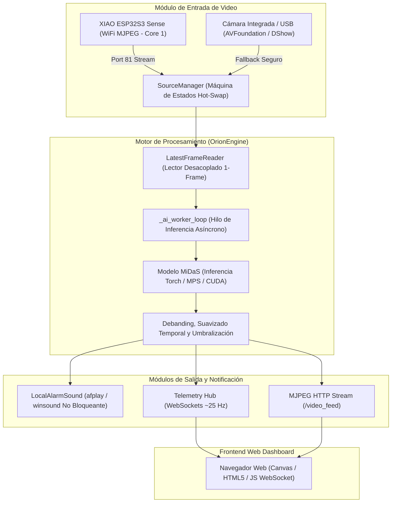
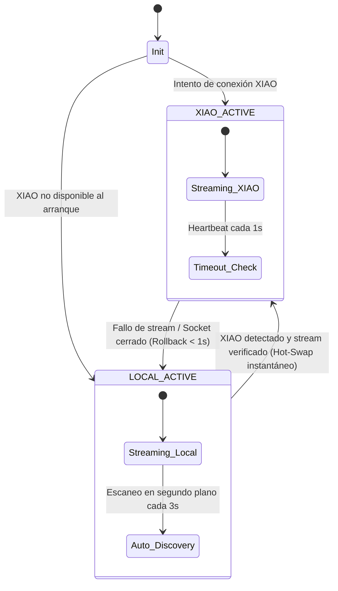

# 🏗️ Arquitectura del Sistema ORION

**ORION** (*Optical Recognition & Intelligent Obstacle Navigation*) es una plataforma de visión por computadora en tiempo real diseñada para la detección proactiva de obstáculos y asistencia de navegación mediante estimación de profundidad monocular y telemetría de baja latencia.

---

## 📐 Diagrama de Flujo General

---

## 1. Pipeline de Captura y Desacoplamiento de Latencia

Uno de los problemas más comunes en el procesamiento de video en tiempo real con redes neuronales es el desfase o retraso acumulativo (*frame lag*). Si la cámara entrega 30 FPS pero el modelo procesa a 15-20 FPS, los buffers convencionales de OpenCV (`cv2.VideoCapture`) acumulan fotogramas atrasados.

### LatestFrameReader (Lector de Último Fotograma)
* Corre en un hilo dedicado con prioridad alta.
* Consume constantemente el flujo entrante y **descarta inmediatamente cualquier fotograma viejo**, manteniendo únicamente el fotograma más reciente en memoria.
* Cuando el hilo de inferencia solicita un fotograma, obtiene exactamente el instante actual sin latencia acumulada (latencia < 33 ms).

---

## 2. Inferencia de Profundidad Monocular (MiDaS)

ORION emplea la arquitectura **MiDaS** (Ranftl et al., Intel ISL) para inferir mapas de profundidad densos a partir de una única cámara RGB:

1. **Preprocesamiento:**
   - Redimensión al ancho de procesamiento (`--proc-width`, por defecto 320 px o 480 px).
   - Conversión de espacio de color BGR a RGB y normalización mediante transforms de Torch Hub.
2. **Ejecución en Hardware:**
   - **Apple Silicon (Mac M1/M2/M3):** Aceleración por Metal Performance Shaders (`mps`) con fallback automático habilitado (`PYTORCH_ENABLE_MPS_FALLBACK=1`).
   - **NVIDIA GPU:** Aceleración por CUDA con `torch.backends.cudnn.benchmark = True`.
   - **CPU:** Optimización multihilo configurando `torch.set_num_threads`.
3. **Postprocesamiento:**
   - **Debanding:** Reducción de artefactos de gradiente mediante filtros de desenfoque gaussianos de bajo costo.
   - **Filtro Temporal IIR:** Suavizado exponencial entre fotogramas consecutivos ($D_t = \alpha D_t + (1-\alpha) D_{t-1}$) para eliminar parpadeo (*flicker*).
   - **Cálculo de Proximidad:** Segmentación por percentiles y evaluación contra `--near-threshold`.

---

## 3. Máquina de Estados de Conmutación en Caliente (Hot-Swap)

El sistema implementa una arquitectura híbrida de alta disponibilidad:

### Transición Segura entre Dispositivos de Captura
* **Prevención de `SIGSEGV: 11` (macOS AVFoundation):** Al cambiar de la cámara web integrada a la cámara de red, el hilo de lectura se detiene (`thread.join()`) **antes** de liberar el puntero nativo de OpenCV (`cap.release()`), evitando accesos a memoria liberada (*use-after-free*) en los drivers multimedia de macOS.
* **Descubrimiento Dinámico de IP:** Si el router DHCP cambia la IP del XIAO, el subsistema [`XiaoDiscoveryManager`](../utils/xiao_discovery.py) escanea la subred en segundo plano, actualiza la dirección en tiempo real y conmuta la fuente de captura sin interrumpir el servidor HTTP ni la conexión de los clientes web.

---

## 4. Sistema de Audio Asíncrono sin Bloqueo

Para alertar al usuario de obstáculos críticos sin degradar los FPS de inferencia ni de video:

* **macOS:** Se utiliza el comando nativo `afplay` en un subproceso desacoplado. Para prevenir la acumulación de procesos zombis, se ejecuta un monitor ligero que limpia los procesos terminados mediante llamadas no bloqueantes `poll()`.
* **Windows:** Se emplea síntesis de onda senoidal en memoria mediante el módulo estándar `wave` y `winsound.PlaySound(..., SND_ASYNC | SND_MEMORY)`.
* **Cooldown de Alarma:** Intervalo mínimo configurable (por defecto 0.8 s) para evitar saturación acústica continua.
