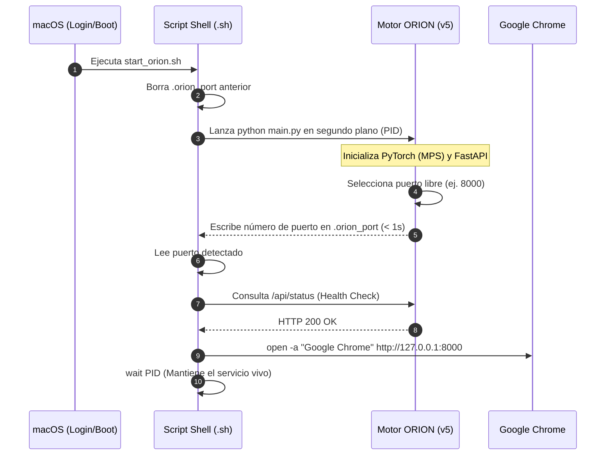

# 🍎 Guía de Configuración: Servicio Automático en macOS

Esta guía documenta la configuración del script de arranque automático y el servicio en segundo plano para que ORION se inicie automáticamente al encender el Mac y abra la interfaz web sin intervención manual.

---

## 🔄 Flujo de Inicialización del Servicio



---

## 📜 Script de Arranque Recomendado (`start_orion.sh`)

Guarda este script en la raíz de tu proyecto en la Mac (`/Users/awuiel/orion_funcionality/start_orion.sh`):

```bash
#!/bin/bash
# ============================================================
# ORION - Arranque Automático en macOS
# ============================================================

# Obtener directorio del proyecto
PROJECT_DIR="$(cd "$(dirname "$0")" && pwd)"
cd "$PROJECT_DIR" || exit 1

echo "=========================================="
echo "      ORION - Automatic Startup"
echo "=========================================="
echo "Proyecto: $PROJECT_DIR"

# ------------------------------------------------------------
# 1. Localizar intérprete de Python en el entorno virtual
# ------------------------------------------------------------
PYTHON="$PROJECT_DIR/venv2/bin/python"

if [ ! -x "$PYTHON" ]; then
    echo "❌ No se encontró Python en el entorno virtual: $PYTHON"
    exit 1
fi
echo "🐍 Python: $PYTHON"

# ------------------------------------------------------------
# 2. Limpiar archivo de puerto anterior
# ------------------------------------------------------------
PORT_FILE="$PROJECT_DIR/.orion_port"
rm -f "$PORT_FILE"

# ------------------------------------------------------------
# 3. Iniciar ORION v5
# ------------------------------------------------------------
echo "🚀 Iniciando ORION..."

# Puedes usar main.py directamente o la ruta a la versión 5
"$PYTHON" main.py &
ORION_PID=$!

echo "   PID: $ORION_PID"

# ------------------------------------------------------------
# 4. Esperar a que ORION escriba el archivo .orion_port
# ------------------------------------------------------------
echo "⏳ Esperando puerto de ORION..."
MAX_WAIT=60
WAITED=0

while [ ! -f "$PORT_FILE" ]; do
    if ! kill -0 "$ORION_PID" 2>/dev/null; then
        echo "❌ ORION terminó inesperadamente antes de asignar puerto."
        exit 1
    fi
    sleep 0.5
    WAITED=$((WAITED + 1))
    if [ "$WAITED" -ge $((MAX_WAIT * 2)) ]; then
        echo "❌ Timeout esperando archivo de puerto (.orion_port)."
        kill -9 "$ORION_PID" 2>/dev/null
        exit 1
    fi
done

PORT=$(cat "$PORT_FILE")
echo "🔌 Puerto detectado: $PORT"

# ------------------------------------------------------------
# 5. Esperar confirmación de salud de FastAPI
# ------------------------------------------------------------
URL="http://127.0.0.1:${PORT}"
HEALTH_URL="${URL}/api/status"
echo "⏳ Esperando que FastAPI responda en: $HEALTH_URL"

WAITED=0
while true; do
    if ! kill -0 "$ORION_PID" 2>/dev/null; then
        echo "❌ ORION terminó inesperadamente durante el health check."
        exit 1
    fi
    if curl -s --max-time 1 "$HEALTH_URL" > /dev/null 2>&1; then
        break
    fi
    sleep 0.5
    WAITED=$((WAITED + 1))
    if [ "$WAITED" -ge $((MAX_WAIT * 2)) ]; then
        echo "❌ Timeout esperando respuesta de FastAPI."
        exit 1
    fi
done

# ------------------------------------------------------------
# 6. Abrir Navegador Web
# ------------------------------------------------------------
echo ""
echo "=========================================="
echo "       🌐 ORION ESTÁ LISTO"
echo "       URL: $URL"
echo "=========================================="
echo "🌎 Abriendo Google Chrome..."

open -a "Google Chrome" "$URL"

# ------------------------------------------------------------
# 7. Mantener el proceso vivo mientras ORION esté activo
# ------------------------------------------------------------
wait "$ORION_PID"
```

---

## 🔍 Diagnóstico y Solución de Problemas Frecuentes

### 1. ¿Por qué se detenía el servicio solo después de 2 minutos?
El script `.sh` anterior tenía un bucle `while [ ! -f "$PORT_FILE" ]` con un límite de 120 segundos (`MAX_WAIT=120`). En versiones preliminares, el script de Python no generaba el archivo `.orion_port`, por lo que al llegar a los 120 segundos, el script de shell asumía un fallo y finalizaba la ejecución matando el proceso. En la versión actual, `.orion_port` se genera en menos de 1 segundo tras la selección del socket.

### 2. Conflicto `externally-managed-environment` (PEP 668)
Si al intentar ejecutar `pip install` en la Mac aparece:
```text
error: externally-managed-environment
```
Esto ocurre porque macOS y Homebrew protegen la instalación global de Python para evitar incompatibilidades en el sistema operativo.

**Solución correcta:** Asegúrate siempre de usar el `pip` del entorno virtual explícito:
```bash
/Users/awuiel/orion_funcionality/venv2/bin/pip install -r requirements-mac.txt
```
O si estás dentro del entorno:
```bash
source venv2/bin/activate
pip install -r requirements-mac.txt
```

### 3. Permisos de Cámara en macOS (AVFoundation)
macOS restringe el acceso a la cámara mediante el sistema de permisos TCC (Transparency, Consent, and Control). Si ejecutas el script desde la Terminal, VS Code o un Daemon de `launchd`, la aplicación host debe contar con permisos:
* Ve a **Ajustes del Sistema $\rightarrow$ Privacidad y Seguridad $\rightarrow$ Cámara**.
* Asegúrate de que **Terminal**, **iTerm2** o **Visual Studio Code** tengan el interruptor activado.
